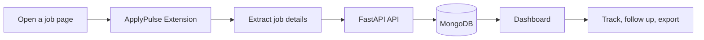

<p align="center">
  
</p>

<p align="center">
  <a href="https://applypulse.onrender.com"></a>
  <a href="https://github.com/jawadahmadliaqat-dot/ApplyPulse"></a>
  
</p>

<p align="center">
  <strong>Capture opportunities. Track momentum. Follow through.</strong><br />
  ApplyPulse is a job application tracker powered by FastAPI, MongoDB, and a Manifest V3 Chrome extension.
</p>

---

## What Is ApplyPulse?

ApplyPulse turns a scattered job search into one focused workspace. Save jobs from LinkedIn, Indeed, and other job pages in one click, enrich them with useful details, and move every application through a clear pipeline.



## Highlights

| Capability | What it does |
| --- | --- |
| One-click capture | Saves title, company, location, URL, source, salary, experience level, and work type |
| Closed-position detection | Marks expired or closed postings as **Position Closed** |
| Quick notes | Add context such as referrals or recruiter contact from the extension popup |
| Pipeline board | Drag applications through Saved, Applied, Interview, Offer, Rejected, and more |
| Analytics | View call rate, application counts, and average response time |
| Follow-up planning | Store follow-up dates and export reminders as an `.ics` calendar file |
| Resume tracking | Record which resume version was used for each application |
| Data export | Download filtered applications as CSV or JSON |
| Secure access | JWT authentication with email/password and Google sign-in support |

## Product Flow

<p align="center">
  
</p>

```text
Discover  ->  Save  ->  Apply  ->  Interview  ->  Offer
     \____________________________________________/
                    Learn from your data
```

## Tech Stack

<p align="center">
  
</p>

- **Backend:** FastAPI, Motor, PyMongo, Pydantic
- **Database:** MongoDB Atlas or local MongoDB
- **Authentication:** JWT, bcrypt, Google OAuth token verification
- **Extension:** Chrome Manifest V3, content scripts, popup UI
- **Frontend:** Server-served HTML, Tailwind CSS, vanilla JavaScript
- **Deployment:** Render-compatible ASGI service

## Project Structure

```text
ApplyPulse/
├── main.py                 # FastAPI application and dashboard routes
├── models.py               # Pydantic job and auth models
├── database.py             # MongoDB client and indexes
├── security.py             # JWT and password helpers
├── routes/
│   ├── auth_routes.py      # Login, signup, and Google auth
│   └── job_routes.py       # Job CRUD endpoints
├── services/
│   └── scraper.py          # Provider job scraping service
├── extension/
│   ├── manifest.json       # Chrome Manifest V3 configuration
│   ├── popup.html          # Extension popup UI
│   ├── popup.js            # Login and save-job workflow
│   └── content.js          # Page extraction logic
├── index.html              # ApplyPulse dashboard
├── render.yaml             # Render deployment configuration
└── requirements.txt        # Python dependencies
```

## Run Locally

### 1. Create an environment

```bash
python -m venv .venv
```

Windows PowerShell:

```powershell
.\.venv\Scripts\Activate.ps1
```

macOS/Linux:

```bash
source .venv/bin/activate
```

### 2. Install dependencies

```bash
pip install -r requirements.txt
```

### 3. Configure environment variables

Create a `.env` file. Never commit this file.

```dotenv
MONGO_URI=mongodb://localhost:27017
DB_NAME=applypulse_db
SECRET_KEY=replace-with-a-long-random-secret
ALGORITHM=HS256
ACCESS_TOKEN_EXPIRE_MINUTES=1440
```

For MongoDB Atlas, use your Atlas connection string and allow the deployment network in Atlas Network Access.

### 4. Start ApplyPulse

```bash
uvicorn main:app --reload
```

Open:

```text
http://127.0.0.1:8000
```

Health check:

```text
http://127.0.0.1:8000/api/health
```

## Install the Chrome Extension

1. Open `chrome://extensions`.
2. Enable **Developer mode**.
3. Select **Load unpacked**.
4. Choose the `extension/` folder.
5. Sign in with the same account used on the dashboard.
6. Open a job page and select **Save this job**.

The extension supports LinkedIn, Indeed, and general job pages with metadata fallbacks.

## API Overview

| Method | Endpoint | Purpose |
| --- | --- | --- |
| `POST` | `/api/auth/signup` | Create an account |
| `POST` | `/api/auth/login` | Email/password login |
| `POST` | `/api/auth/google` | Verify Google access token |
| `GET` | `/api/jobs/` | List the current user's jobs |
| `POST` | `/api/jobs/` | Save a job |
| `PATCH` | `/api/jobs/{job_id}` | Update status or metadata |
| `DELETE` | `/api/jobs/{job_id}` | Delete a job |
| `GET` | `/api/health` | Check service and database health |

Interactive API documentation is available at `/docs` when the server is running.

## Deployment

ApplyPulse can run as a single Render web service serving both the dashboard and API.

```text
Build command: pip install -r requirements.txt
Start command: uvicorn main:app --host 0.0.0.0 --port $PORT
Health path:   /api/health
```

Recommended Render environment variables:

```dotenv
MONGO_URI=<MongoDB Atlas connection string>
DB_NAME=applypulse_db
SECRET_KEY=<strong random secret>
ALGORITHM=HS256
ACCESS_TOKEN_EXPIRE_MINUTES=1440
```

For uptime monitoring, use an external monitor such as UptimeRobot against `/api/health`. An internal self-ping cannot keep a sleeping free instance awake once the process has stopped.

## Security Notes

- Keep `.env` and all database credentials out of Git.
- Rotate any MongoDB password that has been exposed publicly.
- Use a unique production `SECRET_KEY`.
- Restrict CORS origins before opening the service to public traffic.
- Use MongoDB Atlas Network Access rules appropriate for your deployment.

## Roadmap

- Email digest for weekly application summaries
- Native Google Calendar OAuth sync
- Resume file uploads and version history
- More provider-specific extraction adapters
- Automated follow-up notifications

## License

Add your preferred license before publishing the repository publicly.

<p align="center">
  
</p>

<p align="center">
  <strong>Built to make the job search feel less scattered.</strong>
</p>

